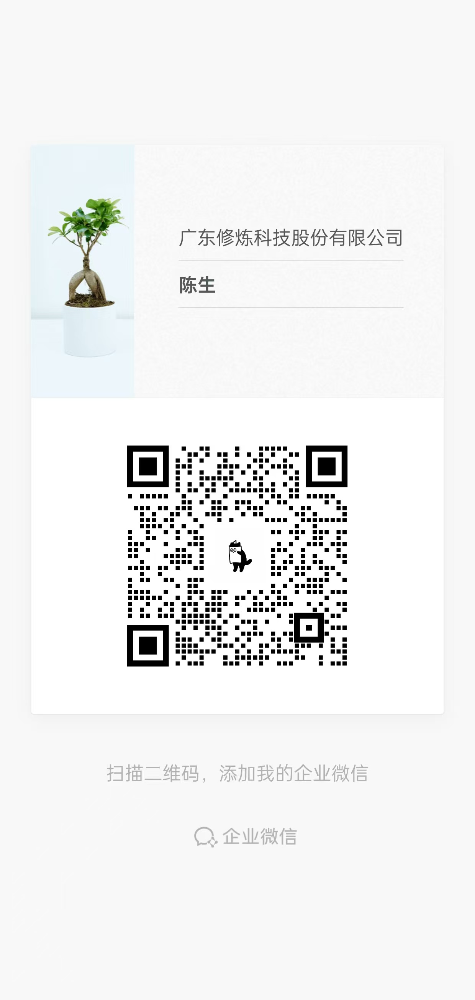

# 介绍
驾培一体化智慧小程序平台，平台采用微服务技术架构设计，通过微服务化实现核心能力，定制能力合理拆分，实现基于服务架构的产品二次开发能力开放，达成灵活升级部署的目标。

微信小程序客户端实现学员在线报名缴费、培训预约、服务评价、学时查询、成绩查询、体检查询，  星级驾校、星级教练、服务网点的公示， 政策法规的了解、培训视频的学习，  教练认证、培训学习、评价查询、从业学习等；

Web后台管理平台实现现场业务的办理、监管，  交通、交警、驾校、协会等部门可以进行报名缴费、清分结算、信誉考核等功能管理；

数据交换平台实现与省驾培监管平台、公安学员考试体检系统、驾校计时系统、银行结算系统等的系统数据交换。

# 软件架构
前端采用uniapp+vue3+TypeScript+uview架构进行布局，后端逻辑使用java进行编程，结构布局层次分明，适合自行结合需求进行定制化开发

# 安装教程

1.  安装 npm run install
2.  启动 npm run dev:mp-weixin
3.  打包 npm run build:mp-weixin

# 小程序扫码演示

如果您觉得此项目对你有帮助，请点亮 Star

# 架构大模型

# 核心功能

# 业务范围

# 功能演示图

# 联系我们(欢迎交流沟通)

